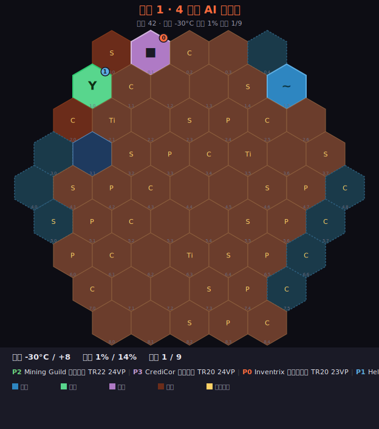
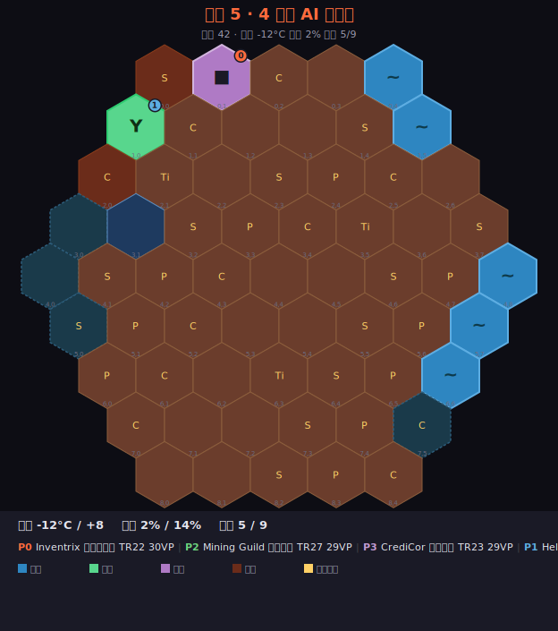
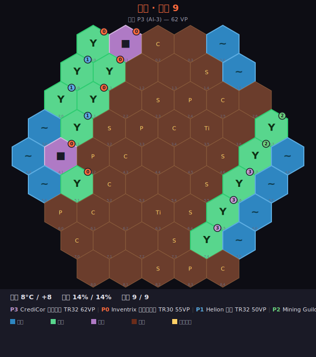

# 殖民火星 (Colonize Mars)

[](https://github.com/kogamishinyajerry-ops/colonize-mars/actions/workflows/ci.yml)


德式策略桌游 *Terraforming Mars* 的 Python + Flask 完整实现，含 **3 个风格各异的 DLC**。
**完全由 Claude (Opus 4.7) 在单个会话内自主开发** —— 从规则逆向工程到 Web UI 到 DLC 设计。

---

## 演示

### 真实游戏快照（4 玩家 AI 自对弈 · seed 42）

下面 3 张是同一局游戏在 **早/中/末期** 的真实棋盘状态（由 `tools/generate_demo_snapshots.py` 渲染为 SVG）：

<table>
<tr>
<td align="center"><b>世代 1 · 起手</b><br></td>
<td align="center"><b>世代 5 · 中盘</b><br></td>
<td align="center"><b>终局 · 三参数全满</b><br></td>
</tr>
</table>

每张图含：完整 9 行六边形棋盘 · 板块（~海洋 · Y绿地 · ■城市）· 拥有者编号圆点 · 地块奖励 · 全球参数 · 玩家排名。

### CLI 自对弈样例（基础模式 · 4 玩家 · seed 42）

```
═══ 世代 1 开始 ═══
  🌱 P0 放置绿地于 (0,1)  +1VP
  🌫 氧气↑ → 1%  (TR+1, P0)
  🌊 P3 放置海洋于 (5,7)  TR+1, 海洋 1/9
═══ 世代 5 开始 ═══
  🌡 温度↑ → -20°C  (TR+1, P2)
  🌡 奖励：P2 热产能+1
  ▶ P1 打出「Geothermal Power 地热发电」 (花费 5M$ + 3钢)
═══ 世代 9 开始 ═══
  🔁 弃牌堆洗回卡组 (24 张)
  🌫 氧气↑ → 14%  (TR+1, P0)
🌍 三大全球参数已达上限！本代结束后终局。
═════════ 游戏结束 · 终局结算 ═════════
🏆 胜者: P3 (AI-3) — 56VP
```

### DLC III「红色风暴」灾害日志（hard 难度 · seed 99）

```
═══ 世代 1 开始 ═══
  🚨 灾害降临：Phobos 偏离「全员 -2 TR」 (+5 威胁)
═══ 世代 2 开始 ═══
  🚨 灾害降临：太阳耀斑「全员能源清零」 (+3 威胁)
═══ 世代 3 开始 ═══
  🚨 灾害降临：反应堆熔毁「高能源产能玩家 -2」 (+4 威胁)
  🤝 P0 → P1 : 5 mc (实际 +5)
  🤝 P2 → P0 : 2 plants (实际 +2)
═══ 世代 7 开始 ═══
  🚨 灾害降临：补给船失踪「全员钢/钛 -5」 (+2 威胁)
  🚒 P1 应急响应：威胁 -3 → 16
```

### Web UI 概览

```
┌──────────────────────────────────────────────────────────┐
│ 🚀 殖民火星  🌡 -10°C ▓▓▓░░  🌫 6% ▓▓░  🌊 3/9 ▓░  世代5 │
├────────────┬──────────────────────────┬──────────────────┤
│  玩家面板  │   火星六边形棋盘 (61格)  │  当前决策面板    │
│ ● P0 (你)  │   可点击 hex             │  - 打出 X (12M$) │
│ ● P1 AI    │   🌊 🌱 🏙 板块图标      │  - 标准项目: 绿地│
│ ● P2 AI    │   🎁 地块奖励            │  - 跳过          │
│ ● P3 AI    │   色彩区分火山/Noctis    ├──────────────────┤
│            │                          │  🃏 手牌区       │
│ 里程碑     │                          │   可玩卡发光     │
│ 奖励       │                          │   点击放大       │
├────────────┴──────────────────────────┴──────────────────┤
│ 📜 战报 (滚动日志，世代/参数变更彩色高亮)                  │
└──────────────────────────────────────────────────────────┘
```

启用 DLC 后会附加面板：DLC III 顶部出现脉冲威胁条；DLC I 玩家卡内显示 ⚔Force/🕵Intel；DLC II 出现派系徽章 (信仰/算力/生物质)。

---

## 实现的核心规则

| 系统 | 状态 | 说明 |
|---|---|---|
| 资源 | ✅ | 6 种：MC / 钢 / 钛 / 植物 / 能源 / 热 |
| 产能 | ✅ | 含能源→热的代际转移；MC 产能可至 -5 |
| 三大全球参数 | ✅ | 温度 (-30→+8 / 步 2°C)、氧气 (0→14%)、海洋 (0→9) |
| TR (Terraforming Rating) | ✅ | 提升任一参数 +1 TR；生产期 TR 加进 MC |
| 火星棋盘 | ✅ | 标准 61 格六边形，海洋预留位、火山区、Noctis 城；地块奖励（钢/钛/植物/卡牌）；海洋邻接 +2MC |
| 板块 | ✅ | 海洋、绿地（自动 +O₂）、城市；绿地必须紧邻自家板块（如有） |
| 卡牌系统 | ✅ | 50 张项目卡（绿/蓝/红）+ 6 张公司卡 |
| 标签系统 | ✅ | 12 种标签，蓝卡上的微生物/动物计数器 |
| 标准项目 | ✅ | 7 项：出售专利、发电站、小行星、含水层、绿地、城市 |
| 里程碑 | ✅ | 5 选 3，达成 +5VP，付 8MC |
| 奖励 | ✅ | 5 选 3 资助（8/14/20MC），终局结算 5/2VP |
| 钢/钛抵扣 | ✅ | 建筑卡用钢 (2MC/钢)，太空卡用钛 (3MC/钛) |
| 公司能力 | ✅ | CrediCor (≥20MC 卡 +4MC)、Helion (热当 MC)、Mining Guild、Tharsis Republic、Inventrix、EcoLine |
| 世代循环 | ✅ | 研究阶段 (4 选 N, 3MC/张) → 行动阶段 → 生产阶段 |
| 终局触发 | ✅ | 三大参数全满；终局后剩余植物自动转绿地 |
| AI 对手 | ✅ | 启发式贪心：标签协同、TR 推动、里程碑/奖励价值评估 |

## 目录结构

```
colonize-mars/
├── main.py                  # CLI 入口
├── README.md
├── game/
│   ├── __init__.py
│   ├── resources.py         # 资源、产能、标签、卡类型
│   ├── board.py             # 61 格六边形棋盘 + 邻接
│   ├── cards.py             # 卡牌基类 + 效果原语 + 资格检查
│   ├── card_library.py      # 50 张项目卡 + 6 张公司卡
│   ├── projects.py          # 7 项标准项目
│   ├── milestones.py        # 5 里程碑 + 5 奖励
│   ├── state.py             # GameState + Player
│   ├── actions.py           # 动作枚举/合法性/执行
│   ├── engine.py            # 世代循环 + 板块放置 + 终局
│   ├── ai.py                # AI 决策启发
│   └── cli.py               # 人类 CLI 决策接口
└── tests/
    └── test_game.py         # 18 项 pytest 回归
```

## 运行

### 🌐 Web UI（推荐）

```bash
pip install flask    # 仅依赖
python3 server.py    # 默认端口 5180
# 浏览器打开 http://127.0.0.1:5180
```

完整桌游界面：
- 实时火星六边形棋盘（放海洋时合法格闪烁高亮，可直接点击）
- 三大全球参数轨道（温度/氧气/海洋进度条）
- 4 玩家面板（资源 + 产能 + TR + VP 实时刷新）
- 手牌细节（标签彩色 chips、可玩卡发光）
- 决策面板按情境切换：选公司 / 研究保留（多选）/ 行动菜单 / 放置位置
- 滚动战报日志
- 里程碑 + 奖励看板
- 终局排名模态

### CLI（极简）

```bash
python3 main.py                  # 你 + 3 AI
python3 main.py --auto --seed 42 # 全 AI 演示
python3 main.py --solo           # 1v1
python3 -m pytest tests/ -v      # 测试
```

## 自对弈样例

种子 `2026`，4×AI，自然结束于第 21 代（三大参数全满）：

```
🌍 三大全球参数已达上限！本代结束后终局。
═════════ 游戏结束 · 终局结算 ═════════
  🏅 奖励「Landlord 大地主」: P2 +5VP
  🏅 奖励「Miner 矿工」: P3 +5VP / P2 +2VP
  P0 (CrediCor): TR=27 | 卡VP=2 | 板块=12 | 里程碑=0 | 奖励=2 | 总分=43
  P1 (Tharsis):  TR=28 | 卡VP=1 | 板块=10 | 里程碑=5 | 奖励=1 | 总分=45
  P2 (Helion):   TR=42 | 卡VP=2 | 板块=22 | 里程碑=10| 奖励=12| 总分=88
  P3 (Mining):   TR=27 | 卡VP=0 | 板块=13 | 里程碑=5 | 奖励=5 | 总分=50
🏆 胜者: P2 (AI-2) — 88VP
```

VP 区间符合典型 TM 比分 (45-90)。

## 设计说明

**对原版的简化**：
- 卡池 50 张（原版 233 张），覆盖所有效果类型作为代表
- 不实现 Prelude / Venus Next / Colonies / Turmoil 扩展
- 标签效果（如 Mars University 弃换）部分简化为被动
- 矿区类卡牌简化为直接给产能（不指定地块）
- 每回合只允许 1 个动作（原版每回合可 2 个）

**保留的核心机制**：
- 钢钛资源-MC 抵扣（决定建筑/太空策略）
- 能源→热转移（每代必发生）
- 海洋邻接 +2MC（板块路径选择）
- 氧气 8% 触发温度（参数耦合）
- 温度 -24/-20 触发热产能、温度 0 触发海洋
- 里程碑先到先得 vs 奖励终局结算

## DLC 系统

启动屏顶部「游戏模式」下拉切换。3 个 DLC **风格各异、玩法各异**：

### DLC I · 轨道战争 (Orbital Warfare) — PvP 冷战
13 张攻防卡 + 2 张军事公司 + Force/Intel 双资源
- **霸权税**：每代 TR 第一名付 5MC（除非 Intel ≥3 抵消）
- **不结盟条约 (NAP)**：3 代不可互攻，违约 -5 TR
- **轨道毁灭性打击**：6 Force 摧毁敌方城市，自伤 -3VP（罪行印记）
- **黑客突袭**：3 Intel 偷敌方 6MC

### DLC II · 平行火星 (Parallel Mars) — 异质派系 + 战役
3 个核心循环完全不同的派系：
- **新巴比伦**：信仰 + 大教堂奇观 + 朝圣队（城市数=VP）
- **协议体**：算力 + 数字孪生 + **奇点**（20 算力+5 科学 = +30VP 立即结束）
- **共生虫群**：生物质 + 蜂巢扩散 + 占领火山口

3 章战役 + 跨局存档 (`~/.colonize-mars/save.json`)，通关解锁新派系/史诗卡。

### DLC III · 红色风暴 (Crimson Storm) — 协作 Roguelike
威胁条 (0→threshold) + 12 种灾害 + 4 档难度 (easy/normal/hard/doom)
- 满阈值 = 全员失败；剩余威胁低 = 通关评级 S
- **援助行动**：无损耗送资源给队友
- **预警卫星卡**：下一代灾害提前公开
- **应急响应**：威胁 -3

### 混合启用
所有 DLC 正交，可任意组合。"全 DLC 混乱模式"= 你既要应付灾害又要避免霸权税还要管理派系资源。

## 测试

```
$ python3 -m pytest tests/ -q
............................                                             [100%]
28 passed in 0.15s
```

- 18 项基础规则（资源/产能/参数/棋盘/卡牌/里程碑/AI 自对弈/确定性回放）
- 10 项 DLC 集成（单 DLC 跑通 + 多 DLC 共存 + 存档读写 + 难度档位 + 基础不退化）
- 6 项 bug 修复回归（卡库扩容/洗牌/total_vp 状态/事件标签/AI DLC 决策/防御性）

## 重新生成演示快照

```bash
python3 tools/generate_demo_snapshots.py
# → 写入 docs/demos/snap_gen01.svg / snap_gen05.svg / snap_final.svg
```

每张 SVG 自带全棋盘 + 全球参数 + 玩家排名，可直接嵌入文档或导入 Figma / Inkscape 二次编辑。

## 项目结构

```
colonize-mars/
├── main.py                  # CLI 入口
├── server.py                # Flask Web 服务器
├── requirements.txt
├── README.md / LICENSE
├── .github/workflows/ci.yml # GitHub Actions (pytest × Python 3.9/3.11/3.12)
├── tools/
│   ├── render_board_svg.py  # 状态→SVG 渲染器
│   └── generate_demo_snapshots.py
├── docs/demos/              # 自动生成的棋盘快照
├── game/
│   ├── resources.py         # 资源/标签/卡类型
│   ├── board.py             # 61 格六边形棋盘 + 邻接
│   ├── cards.py             # 卡牌基类 + 效果原语
│   ├── card_library.py      # 132 张项目卡 + 6 公司卡
│   ├── projects.py          # 7 标准项目
│   ├── milestones.py        # 5 里程碑 + 5 奖励
│   ├── state.py             # GameState + Player + 抽牌洗牌
│   ├── actions.py           # 动作枚举/合法性/执行
│   ├── engine.py            # 世代循环 + 板块放置 + 终局
│   ├── ai.py                # AI 启发式（含 DLC 评分）
│   ├── cli.py               # CLI 决策接口
│   ├── web_session.py       # Web 会话（后台线程 + 决策队列）
│   └── dlc/
│       ├── base.py          # DLC 基类与管理器（12 钩子）
│       ├── orbital.py       # DLC I 轨道战争
│       ├── parallel.py      # DLC II 平行火星 + 战役/存档
│       └── crimson.py       # DLC III 红色风暴
├── static/
│   ├── index.html           # SPA
│   ├── style.css            # 自定义主题 (火星橙)
│   └── game.js              # 棋盘 SVG / 决策面板 / 轮询
└── tests/
    ├── test_game.py         # 18 项基础回归
    └── test_dlcs.py         # 16 项 DLC + 修复回归
```

## 致谢

- 桌游原作 *Terraforming Mars* 设计：Jacob Fryxelius（FryxGames 出版）
- 完全自主开发：[Claude Code (Opus 4.7)](https://www.anthropic.com/claude/claude-4)
- 本仓库为爱好者复刻，仅供学习交流，与官方发行商无关

## License

MIT — 详见 [LICENSE](LICENSE)
